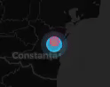

# Convoy Route Optimizer

[](https://github.com/gadaugherty/convoy-routes)

A military logistics routing system that optimizes supply delivery across global bases while respecting vehicle constraints, range limitations, and threat levels.


## What It Does

Solves constrained vehicle routing for military operations: given supply points, priority destinations, and a mixed fleet—find optimal routes considering capacity limits, vehicle range, and threat zone avoidance.


## Features

- **Interactive Tactical Map**: Dark-themed Leaflet map with zoom-responsive icons and clickable supply points
  
  
- **Real Base Data**: 85 US military installations worldwide across 5 regions (CONUS, PACIFIC, EUROPE, MIDEAST, AFRICA)
- **Multi-Modal Transport**: Ground vehicles, aircraft, and watercraft with realistic range/capacity specs
- **Priority-Based Routing**: Critical destinations pulse with red glow; high-priority deliveries scheduled first

  
  
- **Shipping Time Estimates**: Click any destination to see delivery times via available transport modes
- **Route Visualization**: Clickable convoy routes displayed on map after optimization
  
  
  


## Tech Stack

- **Backend**: Flask (Python)
- **Frontend**: Leaflet.js, vanilla JavaScript
- **Data**: pandas for base/inventory processing
- **Routing**: Graph-based pathfinding with greedy nearest-neighbor algorithm via `ConvoyOptimizer` class
- **Distance**: Haversine formula for great-circle calculations

## Running Locally

```bash
pip install flask pandas
python app.py
```


Then open `http://localhost:5000` in your browser.

## Development Notes

- Python changes require server restart
- HTML/JS changes only need browser refresh
- Flask config uses `TEMPLATES_AUTO_RELOAD=True` and `SEND_FILE_MAX_AGE_DEFAULT=0` to avoid caching issues

## Project Structure

```
convoy-routes/
├── app.py                  # Flask application
├── requirements.txt
├── data/
│   ├── destinations.csv
│   ├── routes.csv
│   ├── supply_points.csv
│   └── vehicles.csv
├── src/
│   ├── __init__.py
│   ├── data_loader.py
│   └── optimizer.py
└── templates/
    └── index.html
```
